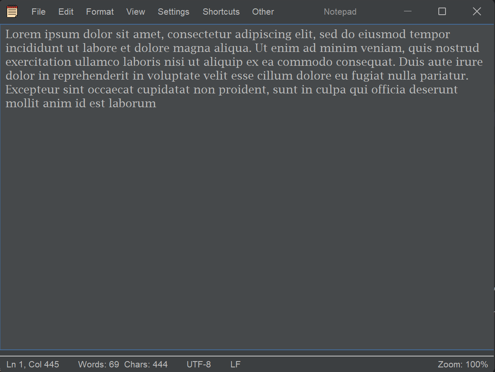
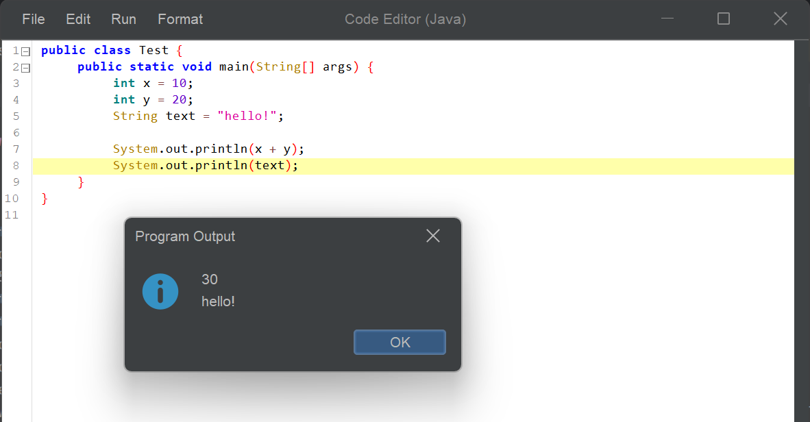
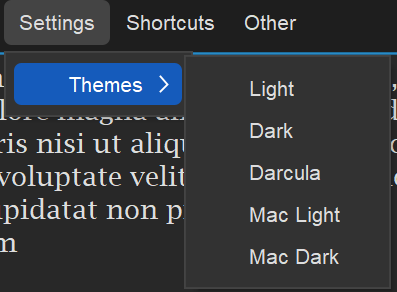
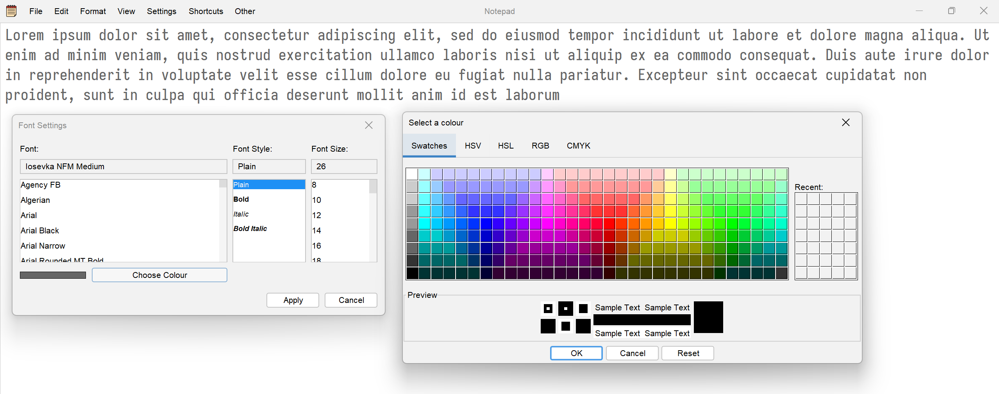
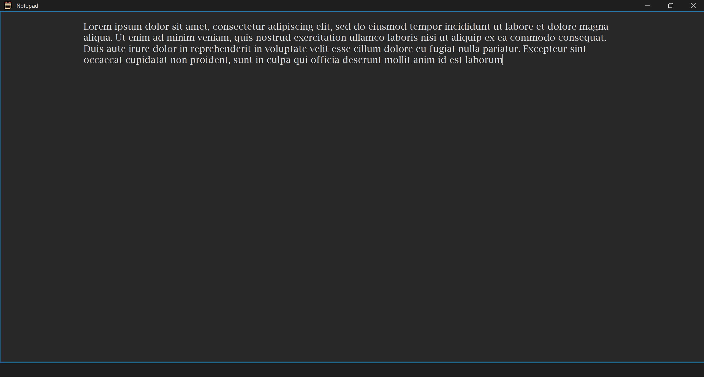
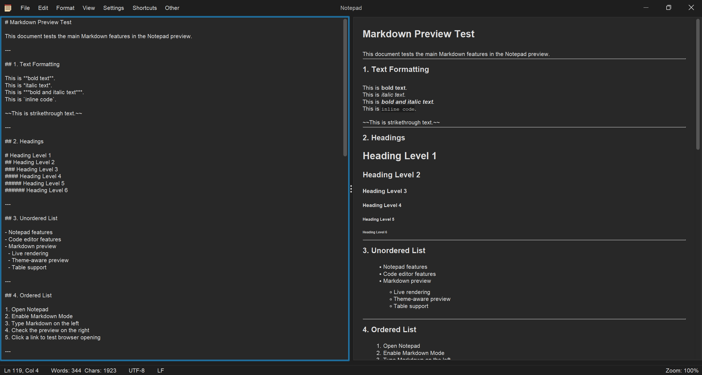
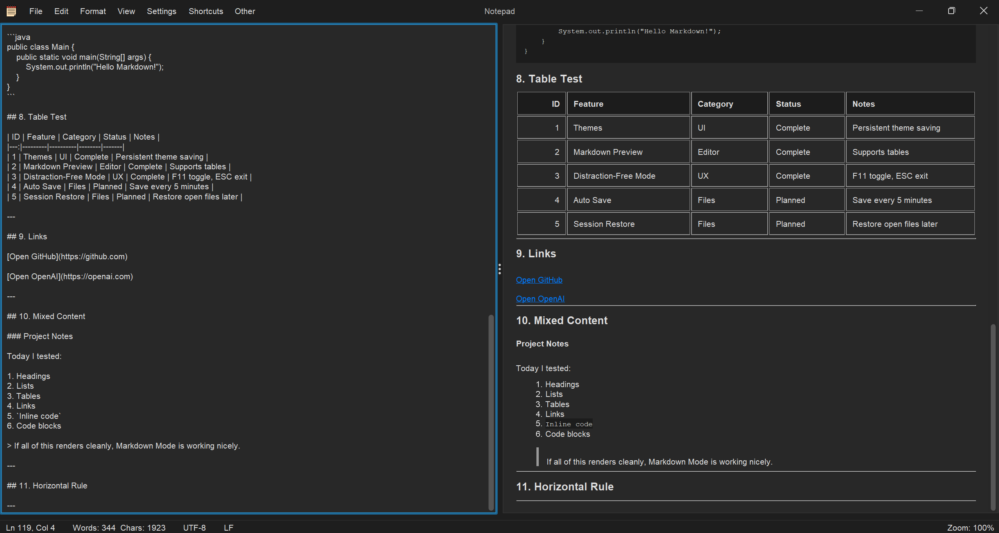
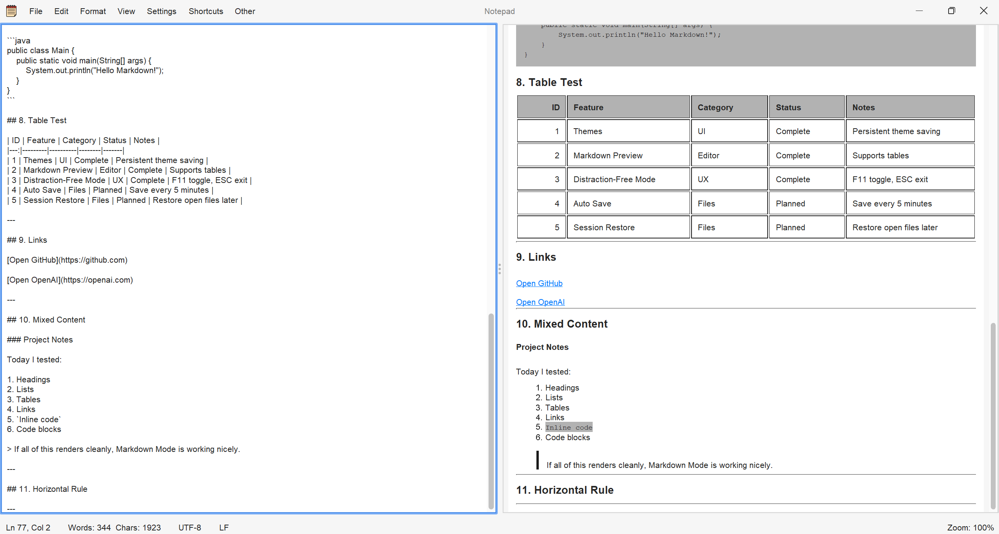

# Notepad & Code Editor


## Introduction

This project started in late 2024 as a simple notepad application and has gradually evolved into a combined notepad and code editor.

## Screenshots

### Main Editor


### Code Editor


### Themes


### Font Editor


### Distraction Free Mode


### Markdown Mode




## Tech Stack

### Core
- Java 22
- Java Swing
- Maven

### UI & Styling
- MigLayout
- FlatLaf
- RSyntaxTextArea
- CommonMark

### Logging & Testing
- SLF4J + Logback
- JUnit 5

## Current Features

### Notepad

- Save and open files
- Standard edit options including cut, copy, paste, undo and redo
- Find and Find & Replace (with regex support)
- Align text left or right
- Change the font, including font style, font size, and colour
- Zoom in, zoom out and restore to default zoom
- Multiple built-in themes including Light, Dark, Darcula, Mac Light, and Mac Dark with persistent theme saving
- Distraction-Free Mode (hides the status bar, menu bar, and centers the text)
- Status bar showing the current line and column, word and character count, encoding, EOL format, and zoom level.
  (The encoding and EOL are hardcoded for now but will allow for change in the future)
- Custom file extension support (planned to evolve into a fully custom note format with metadata)
- Markdown Mode

### Code Editor

- Save and open files
- Cut, copy, and paste code
- Compile and run code (currently supported for languages that require compilation, such as Java)
- Reformat the code

Currently, the only languages supported in the code editor are Java, Python, and JavaScript but more languages will be added.
(More in the next section)

## Future Features

Below are some features currently in development or planned for future releases:

### Notepad
- Markdown mode (in development)
- Auto save + recovery
- Session restore
- Local database for notes
- Encrypted notes
- Custom file extension with metadata so it is fully custom
- Executable jar file

### Code Editor

- Tabbed editing (like in VS Code)
- Implement more languages into the code editor, including:
  - HTML
  - CSS
  - SQL
  - C
  - C++
  - C#

## Running the Application

Currently, the project is intended to be run through an IDE such as IntelliJ IDEA while development is ongoing.

1. Clone the repository e.g., 
   ```
   git clone https://github.com/JoelBoci/Notepad_CodeEditor.git
   ```
   
2. Open the repo in a code editor like IntelliJ
3. Go to the main class in src/main/java/com/notepad/app/Main.java
4. Run Main.java
5. Notepad should launch
